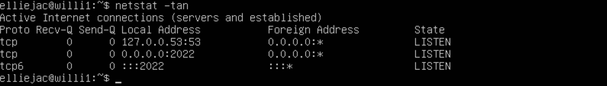
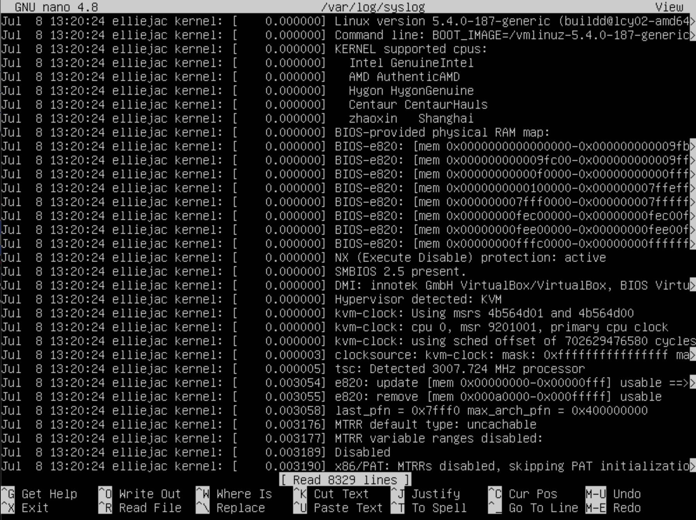

## Part 1

- Команда показать версию ubuntu и ее результат.

## Part 2

- Добавление нового пользователя.

- Добавление нового пользователя в команду adm.

- Результат команды `cat /etc/passwd`.

## Part 3

- Изменение имени хоста командой `sudo hostnamectl set-hostname name`.
- Обновление имени хоста командой `exec bash`.
- Вывод нового имени хоста.

- Командой `timedatectl` узнаем текущую временную зону.
- Командой `sudo timedatectl set-timezone Europe/Moscow` меняем текущую временную зону.

- Командой `ifconfig -a` узнаем названия сетевых интерфейсов.
- Или командой `ip link` узнаем названия сетевых интерфейсов.

#### Интерфейс lo представляет собой виртуальный интерфейс, который используется для взаимодействия процессов на самом компьютере без обращения к физической сети.
#### Он обычно имеет IP-адрес 127.0.0.1 (localhost), который указывает на сам компьютер.
#### Интерфейс lo является неотъемлемой частью конфигурации сети в Linux и других операционных системах.
#### Он обеспечивает стабильное и надежное взаимодействие приложений.
 

- Командой `ifconfig` узнаем названия сетевых интерфейсов.
- Или командой `ip addr` узнаем названия сетевых интерфейсов.

#### **Dynamic** - Динамический
#### **DHCP** позволяет динамически (автоматически) назначать IP-адреса и другие сетевые параметры устройствам в сети.
#### **Host** - Хост
#### Хост обозначает устройство (например, компьютер или смартфон), которому присваивается сетевая конфигурация.
#### **Configuration** - Конфигурация
#### DHCP конфигурирует (устанавливает) сетевые параметры устройства, такие как IP-адрес, шлюз, DNS-серверы и другие настройки.
#### **Protocol** - Протокол
#### **DHCP** является сетевым протоколом, обеспечивающим автоматическую настройку IP-адресов и других сетевых параметров в компьютерных сетях.
#### Таким образом, **Dynamic Host Configuration Protocol (DHCP)** представляет собой протокол для автоматической настройки сетевых параметров устройств в компьютерных сетях, что делает процесс управления IP-адресами и другими параметрами более эффективным и удобным для администраторов сети и пользователей.
 

- Командой `curl ifconfig.me/ip` узнаем внешний ip-адрес шлюза.
- Командой `ip route` узнаем внутренний IP-адрес шлюза.

- Командой ` sudo nano /etc/netplan/00-installer-config.yaml` открываем файл и заполняем как на скрине.
- Командой `sudo netplan apply` применить настройки.
- Командой `sudo reboot` перезагрузить.

- Командой `ip route show` проверить после перезагрузки.

- Командой `ping 1.1.1.1` проверить после перезагрузки.

## Part 4

- Командой `sudo apt update` обновляем список доступных пакетов с репозиториев.
- Командой `sudo apt upgrade` обновляем.
- Командой `sudo apt update` проверяем после обновления.

## Part 5

- Командой `sudo usermod -aG sudo name` добавляем пользователя в группу sudo.

#### Команда **sudo** ( **substitute user and do**, подменить пользователя и выполнить ) позволяет строго определенным пользователям выполнять указанные программы с административными привилегиями без ввода пароля суперпользователя **root**. Если быть точнее, то команда **sudo** позволяет выполнять программы от имени любого пользователя, но, если идентификатор или имя этого пользователя не указаны, то предполагается выполнение от имени суперпользователя **root**. Таким образом, использование sudo позволяет выполнять привилегированные команды обычным пользователям без необходимости ввода пароля суперпользователя **root**. Список пользователей и перечень их прав по отношению к ресурсам системы может быть настроен оптимальным образом для обеспечения комфортной и безопасной работы. Например, команда **sudo** в **Ubuntu Linux**, используется в режиме, позволяющем выполнять любые задачи администрирования системы без интерактивного входа под учетной записью **root**.
 

- Командой `hostname` смотрим имя хоста.
- Командой `su name` переходим на пользователя созданого в **Allpart/part 2**.
- Командой `sudo hostnamectl set-hostname name` меняем имя.
- Командой `hostname` смотрим имя хоста.

## Part 6

- Командой `timedatectl show` смотрим время.

## Part 7

- Сохранить `Ctrl + O`, затем нажмите Enter для сохранения, и `Ctrl + X` для выхода.

- `:wq` и нажмите Enter для сохранения и выхода.

Чтобы сохранить изменения и выйти, нажмите `Ctrl + K - X` , 

- Чтобы выйти без сохранения изменений `Ctrl + X`.

- Чтобы выйти без сохранения изменений `:q!`.

- Чтобы выйти без записи `Ctrl + С`, с запросом на подтверждение утраты сделанных изменений, буде таковые имелись;

- Результат не изменился.

- `Option R` сначало слово поиска потом слово замены.

- Команда `:%s/twitchis/21 School 21/g` для замены.

`Ctrl+K-F` замена; для замены надо в опциях (запрашиваются после ввода образца) указать R Поиск/замена понимает регулярные выражения

## Part 8

- Команда `sudo apt install ssh` для установки SSH.

- Добавление автостарта для ssh.

- Переписал порт с 22 на 2022.

- Команда ps с ключами -axfv

-a: Выбрать все процессы, кроме лидеров сеансов и процессов, не связанных с терминалом.\

-x: Заставляет ps отображать список всех процессов, которыми вы владеете (тот же EUID, что и у ps), или перечислять все процессы при использовании вместе с опцией a.\

-f: Выводить полноформатный список\

-v: Выводить информацию о версии

- Вывод команды `netstat -tan` должен содержать `tcp 0 0 0.0.0.0:2022 0.0.0.0:* LISTEN`

-a показывает состояние всех сокетов\
-n показывает ip адрес, а не сетевое имя\
-t показывает только tcp соединения.

Значения столбцов:

Proto - протокол, используемый сокетом;\
Recv-Q - количество байтов, не скопированных пользовательской программой, подключенной к этому сокету\
Local Address - локальный адрес (имя локального хоста) и номер порта сокета\
Foreign Address - удаленный адрес (имя удаленного хоста) и номер порта сокета\
State - состояние сокета\
0.0.0.0 в этом контексте означает "все IP-адреса на локальной машине"

## Part 9

- Запустил утилиту Top.

- Запустил утилиту Htop.

- По выводу команды top определи и напиши в отчёте:
    - uptime 00:50:31 min
    - количество авторизованных пользователей 1
    - общую загрузку системы 0,07 0,02 0,00
    - общее количество процессов 94 total
    - загрузку cpu 0,0 us 0,0 sy 0,0 ni 0,0 si 0,0 st
    - загрузку памяти 146,3 used
    - pid процесса занимающего больше всего памяти 1473
    - pid процесса, занимающего больше всего процессорного времени 1473
htop отсортированному по PID, PERCENT_CPU, PERCENT_MEM, TIME 

- Сортировка PID.

- Сортировка PERCENT_CPU.

- Сортировка PERCENT_MEM.

- Сортировка TIME.

- отфильтрованному для процесса sshd.

- с процессом syslog, найденным, используя поиск.

- с добавленным выводом hostname, clock и uptime.

## Part 10

- название жесткого диска: **/dev/sda**
- его размер и количество секторов: **26843545600 bytes, 52428800 sectors**

- размер swap: **2 GiB (swapon --show)**

## Part 11

`df /` для корневого раздела

- В отчёте напиши для корневого раздела (/):
    - размер раздела: **11758760**
    - размер занятого пространства: **4769196**
    - размер свободного пространства: **6370456**
    - процент использования: **43%**

- Стандартно в выводе df используются килобайты, но можно добавить флаг -h чтобы налядно видеть единицы измерения.

- `df /` для корневого раздела
df -Th / для корневого раздела (флаг -h для единиц измерения, -T для вывода типа файловой системы)

-- В отчёте напиши для корневого раздела (/):
    - размер раздела: **12G**
- размер занятого пространства: **4,6G**
- размер свободного пространства: **6,1G**
- процент использования: **43%**
- тип файловой системы для раздела: **ext4**

## Part 12

- Вывод `du`.

- `du -sb` (-b в байтах -s показывает только суммарные данные).

- `du -sb /var/log/*`.

## Part 13

* Установи утилиту ncdu

`sudo apt install ncdu`

* Выведи размер папок /home, /var, /var/log

\
/home

\
/var

\
/var/log

## Part 14

* Открой для просмотра:
##### 1. /var/log/dmesg

- `nano -v /var/log/dmesg`
##### 2. /var/log/syslog

- `nano -v /var/log/syslog`
##### 3. /var/log/auth.log
  
- `nano -v /var/log/auth.log`

 Напиши в отчёте время последней успешной авторизации: 
 
* FEB 16 12:24:37 `cat /var/log/auth.log | grep "session"`
* имя пользователя: twitchis 
* и метод входа в систему: TTY: tty1 
* Перезапусти службу SSHd\

`sudo systemctl restart ssh`

* Вставь в отчёт скрин с сообщением о рестарте службы (искать в логах).

- Логи о перезапуске службы

## **Part 15**

- Для использования планировщика заданий `CRON` необходимо его установить при помощи команды
    
    
> sudo apt install cron

- Для работы в фоновом режиме необходимо использовать команду
   

> sudo systemctl enable cron
> 

- Для редактирования `crontab -e` , далее выбрать редактор
- Назначаем команду для запуска каждые 2 минуты `/2 * * * * uptime`

- Для проверки автозапуска команд в `/var/log/syslog`
- Проверяем текущие задачи cron
    

    
> crontab -l

- Для удаления задач cron пишем
    
   

> crontab -r

Готово